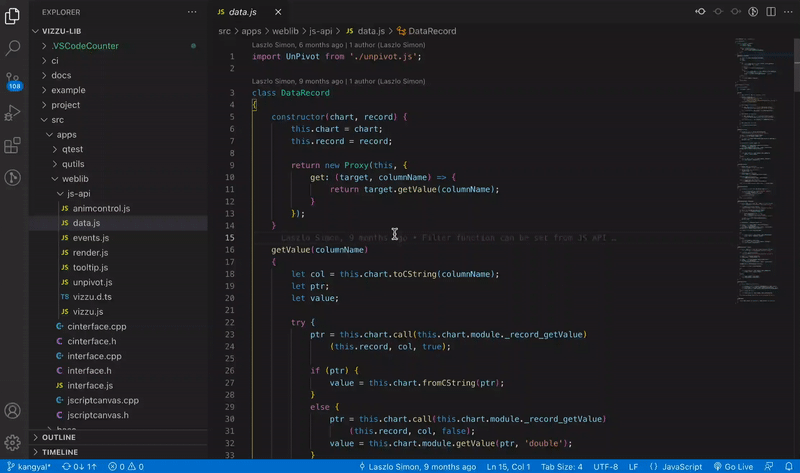
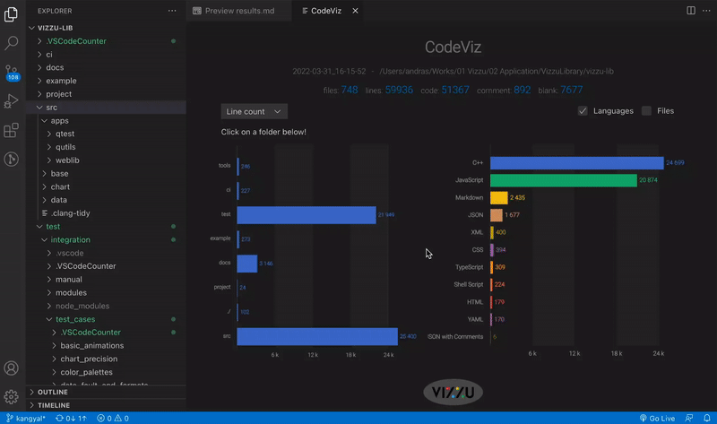
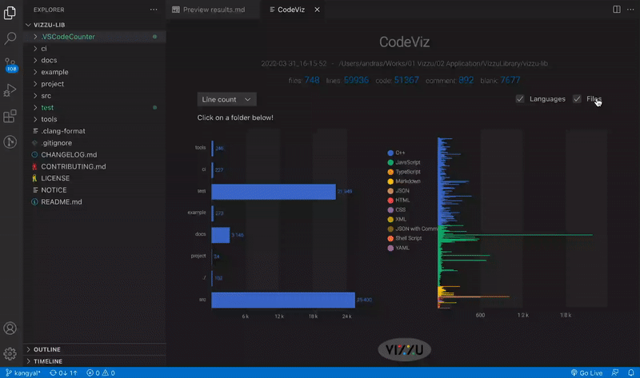

# CodeViz Stat

Interactive source code statistics with animated vizualizations.

- [GitHub](https://github.com/vizzuhq/codeviz/)
- [Marketplace](https://marketplace.visualstudio.com/items?itemName=vizzuhq.code-viz-stat)

Built on top of the great [VS Code Counter](https://marketplace.visualstudio.com/items?itemName=uctakeoff.vscode-counter) by Kentaro Usiyama.

Built using the open-source Javascript charting library [Vizzu](https://github.com/vizzuhq/vizzu-lib).

If you have a feature request, found a bug or just want to share your experience using CodeViz, come and join the conversation on our GitHub Discussions page.

## Features
- Counts and visualizes the files and code lines of source code in the workspace.
- Shows file count and line count in total and by programming languages.
- Allows navigation within the project folders, filtering the visualized data accordingly.
- Shows tooltip with details on mouseover.

## Usage
### Launching CodeViz

### Switch between the no. of lines and the no. of files

### Break down the data by languages and/or files

When grouping and coloring by languages is switched off, the files are shown in the decreasing order of the line count.

### Navigate through your project by clicking on the folders on the left

**Enjoy!**
